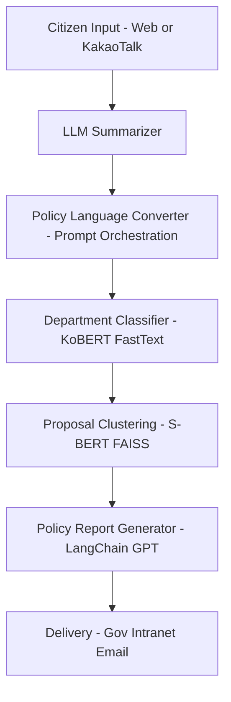

# RAG-Fusion–Based AI Agent Policy Engagement Chatbot

**A Bidirectional Participatory Governance Innovation Service That Transforms Citizen Proposals into Policies in Real Time and Automatically Delivers Them to Administrative Departments**

---

## Award

**Excellence Award, 2025 Chuncheon Generative AI Idea Competition**

---

## 1. Project Overview

This project proposes a **RAG-Fusion–based Multi-Agent AI platform** that automatically summarizes and refines citizen proposals, transforms them into “policy language,” and delivers them to the appropriate administrative departments in real time.
Duplicate or similar proposals are clustered and compiled into automated reports, which are distributed to public officials in PDF/HTML/Word formats.

---

## 2. Key Features

* **Natural Language Summarizer**: Extracts key points from long, unstructured proposals
* **Policy Language Converter**: Transforms everyday expressions into formal administrative wording
* **Automatic Department Classifier**: Multi-label classification model for department mapping
* **Proposal Clustering**: Sentence-BERT + FAISS–based clustering for duplicate detection
* **Policy Report Generator**: Automated weekly/monthly reports (PDF, HTML, DOCX)

---

## 3. Architecture

---

## 4. Tech Stack

* **Frontend**: React.js, TailwindCSS, Kakao Chat API
* **Backend**: Python (FastAPI), Uvicorn, Gunicorn
* **Databases**: MongoDB (citizen proposal logs), PostgreSQL (policy mapping)
* **AI Models**:

  * Summarization: KoAlpaca, GPT-4, KoGPT
  * Policy Conversion: LangChain + Prompt Templates
  * Classification: KoBERT, FastText, scikit-learn
  * Clustering: Sentence-BERT + FAISS + KMeans
  * Reporting: LangChain, jinja2, pdfkit, python-docx
* **Deployment**: Docker, Nginx, AWS EC2, S3

---

## 5. Data Pipeline

1. **Collection**: Crawling citizen proposals (Scrapy) from public portals
2. **Augmentation**: Synthetic proposals via GPT-based data generation (10,000+ cases)
3. **Preprocessing**: Sentence splitting (KSS), spelling correction (SoYNLP, Hanspell)
4. **Topic Modeling**: TF-IDF, LDA, BERTopic to build policy taxonomies
5. **Labeling**: Active Learning + Prodi.gy + MTurk for consistency (>90%)

---

## 6. Service Access

* **For Citizens**: City Hall main website chatbot / mobile / KakaoTalk channel
* **For Officials**: Government intranet, automated email reports
* **Report Formats**: PDF, HTML, DOCX

---

## 7. Expected Outcomes

* **Administrative Efficiency**: Automates summarization, classification, and clustering
* **Enhanced Citizen Participation**: Free-text suggestions → formal policy input
* **Automated Reporting**: Weekly/monthly citizen proposal reports
* **Collaborative Governance**: Multi-department proposal mapping and visualization
* **Increased Trust**: Transparent process where citizens see their input reflected in policy

---

## 8. Future Roadmap

* Integration with **participatory budgeting, local ordinance suggestions, and survey analysis**
* AI-powered **policy recommendation system** with RAG
* Real-time **policy KPI monitoring dashboards**
* End-to-end **citizen proposal tracking system**

---

## 9. References

* Yun, S. et al. (2024). *Trends and Applications of Generative AI.*
* Kim, Y. (2023, 2024). *Legal Responsibilities of Generative AI Service Providers.*
* Kang, Y. et al. (2023). *AI in Electronic Record Management.*
* Kim, G. et al. (2023). *Improving Public Service Quality with AI Chatbots.*
